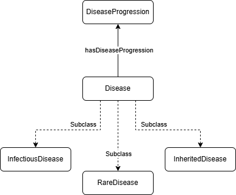

We will start by describing how to represent a disease and its progression using **OSDi**. We will just define the elements but not the parameters that characterize the progression and risks.

### 3.1. Defining the Disease



The **Disease** (`osdi:Disease`) class is specialized using subtypes like `osdi:InheritedDisease` or `osdi:RareDisease`. The automated generation of models is expected to use this information in the future to infer the best model paradigm and structure based on this and other characteristics. 

BD is modeled as an inherited and rare disease using `osdi:InheritedDisease` and `osdi:RareDisease`. 

**TTL Example:**

```turtle
osdi:BD_Disease
    a osdi:InheritedDisease ,
      osdi:RareDisease ;
    rdfs:label "Biotinidase deficiency"@en ,
               "Deficiencia de biotinidasa"@es ;
    osdi:hasDescription "Inherited metabolic disorder caused by deficiency of the biotinidase enzyme. The decision model distinguishes profound and partial biotinidase deficiency, each with its own untreated reference development."@en .
```
