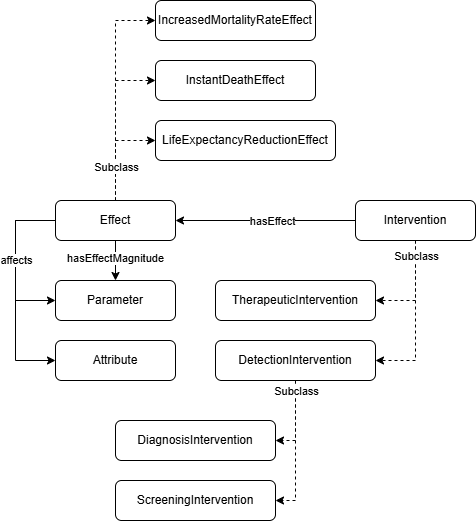

Within each model, you must define one or more **Interventions** ([`osdi:Intervention`]({{ config.extra.osdi }}#Intervention)) to be assessed for cost-effectiveness. In the typical scenario for one intervention versus a comparator, the assessed intervention will be identified by setting [`osdi:isAssessedIntervention`]({{ config.extra.osdi }}#isAssessedIntervention) to `true`.



**TTL Example (Interventions for comparing NBS versus clinical detection):**

```turtle
osdi:BD_InterventionNoScreening 
    a owl:NamedIndividual , osdi:DiagnosisIntervention ;
    osdi:hasDescription "No screening, i.e., clinical detection, of BD" ;
    osdi:isAssessedIntervention "false"^^xsd:boolean .

osdi:BD_InterventionScreening 
    a owl:NamedIndividual ,  osdi:ScreeningIntervention ;
    osdi:hasCost osdi:BD_CostScreening ;
    osdi:hasSensitivity osdi:BD_ScreeningSensitivity ;
    osdi:hasSpecificity osdi:BD_ScreeningSpecificity ;
    osdi:hasEffect osdi:BD_InterventionScreeningEffect ;
    osdi:hasDescription "Basic screening intervention for BD" ;
    osdi:isAssessedIntervention "true"^^xsd:boolean .
```

**Interventions** may involve costs and disutilities, but they should have some kind of effect ([`osdi:hasEffect`]({{ config.extra.osdi }}#hasEffect)) on the progression of the disease or the use of resources. **Effects** ([`osdi:Effect`]({{ config.extra.osdi }}#Effect)) are defined by the [`osdi:Attribute`]({{ config.extra.osdi }}#Attribute) or [`osdi:Parameter`]({{ config.extra.osdi }}#Parameter) they affect ([`osdi:affect`]({{ config.extra.osdi }}#affect)), and a Parameter that characterize the magnitude of the effect ([`osdi:hasEffectMagnitude`]({{ config.extra.osdi }}#hasEffectMagnitude)).

For example, according to the reference case, the effect of the screening should be to prevent the appearance of the manifestations related to profound BD. You can also use relative risks or mean differences to model such effects. 

**TTL Example (Effect of the screening):**

```turtle
osdi:BD_InterventionScreeningEffect 
    a owl:NamedIndividual ,  osdi:Effect ;
    osdi:hasDataItemType osdi:DI_Continuous_Variable ;
    osdi:affects osdi:BD_Proportion_Seizures_PBD , ... ;
    osdi:hasDescription "Sets the probabilities of all the manifestations to 0" ;
    osdi:hasEffectMagnitude osdi:BD_InterventionScreeningEffectMagnitude .

osdi:BD_InterventionScreeningEffectMagnitude 
    a owl:NamedIndividual ,  osdi:DeterministicParameter ;
    osdi:hasDataItemType osdi:DI_Continuous_Variable ;
    osdi:hasExpectedValue "0.0"^^xsd:double .

```

Effects can be also triggered by health conditions ([`osdi:HealthCondition`]({{ config.extra.osdi }}#HealthCondition)), pathways ([`osdi:Pathway`]({{ config.extra.osdi }}#Pathway)), and even populations ([`osdi:Population`]({{ config.extra.osdi }}#Population)). Currently, **OSDi** includes a number of specific effects of particular interest, such as sudden death ([`osdi:InstantDeathEffect`]({{ config.extra.osdi }}#InstantDeathEffect)), whose magnitude is the probability of the death event; life expectancy reduction ([`osdi:LifeExpectancyReductionEffect`]({{ config.extra.osdi }}#LifeExpectancyReductionEffect)) or increased mortality rate ([`osdi:IncreasedMortalityRateEffect`]({{ config.extra.osdi }}#IncreasedMortalityRateEffect)).
