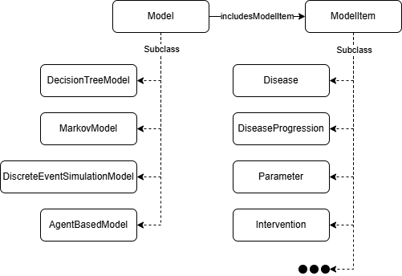

The **Model** class ([`osdi:Model`]({{ config.extra.osdi }}#Model)) is the central container for the entire HTA simulation. A user may create different models using the same individuals from the ontology. Individuals are then linked to the model by using the property [`osdi:includesModelItem`]({{ config.extra.osdi }}#includesModelItem).



Currently, **OSDi** includes four modeling paradigms: decision trees ([`osdi:DecisionTreeModel`]({{ config.extra.osdi }}#DecisionTreeModel)), Markov ([`osdi:MarkovModel`]({{ config.extra.osdi }}#MarkovModel)), discrete event simulation ([`osdi:DiscreteEventSimulationModel`]({{ config.extra.osdi }}#DiscreteEventSimulationModel)) and agent-based ([`osdi:AgentBasedModel`]({{ config.extra.osdi }}#AgentBasedModel)).

The BD analysis is structured as a decision tree model.

**TTL Example (A decision tree model for the screening of BD):**

```turtle
osdi:BD_DecisionTreeModel
    a osdi:DecisionTreeModel ;
    rdfs:label "Decision tree model for BD"@en ;
    osdi:hasDescription "Decision tree model for newborn screening of biotinidase deficiency. It compares two strategies: (1) newborn screening for biotinidase deficiency with confirmatory testing and biotin treatment, and (2) no newborn screening (clinical detection only). " ;
    osdi:includesModelItem osdi:BD_Disease , osdi:BD_Seizures , ... , osdi:BD_ManifestationSet , osdi:BD_InterventionNoScreening , ... .
```
