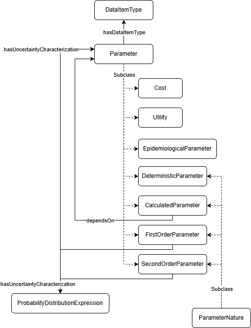

## 4. Parameters

Models require several types of parameters: probabilities, costs, utilities... Apart from the numeric value, parameters require the definition of many other properties to be appropriately used or to allow for inference. For example, the risk of suffering some kind of manifestation could be 0.3, but the utilization of this value in a model would be completely different depending on whether it is a probability, a ratio, a proportion, an odd... Besides, parameters have some kind of uncertainty associated to their values. Such uncertainty would represent variability among individuals (first-order uncertainty) or the degree of confidence on your estimates (second-order uncertainty).

Instead of using data properties to define the quantifiable values required by a model, we have created a more complex set of concepts to wrap them. Individuals representing parameters must inherit from two different classes at the same time: **Parameter** ([`osdi:Parameter`]({{ config.extra.osdi }}#Parameter)) and **Parameter Nature** (e.g., [`osdi:DeterministicParameter`]({{ config.extra.osdi }}#DeterministicParameter)), and define a **Data Item Type** ([`osdi:DataItemType`]({{ config.extra.osdi }}#DataItemType)) by means of the [`osdi:hasDataItemType`]({{ config.extra.osdi }}#hasDataItemType) property.



We will use a number of simple examples to illustrate how to properly define parameters.

### 4.1. Defining a simple deterministic value

In the original reference study, sensitivity of the screening test was assumed to be 100%. This is a good example of a deterministic parameter. As seen in the code below, the individual is both a **Parameter** and a **Deterministic Parameter**. There is a specific **Data Item Type** for sensitivity ([`osdi:DI_Sensitivity`]({{ config.extra.osdi }}#DI_Sensitivity)); otherwise, a more generic type might be used ([`osdi:DI_Probability`]({{ config.extra.osdi }}#DI_Probability)). It is important always to add the source of the parameter, even when it comes from an assumption. Information on the year the parameter applies to ([`osdi:hasYear`]({{ config.extra.osdi }}#hasYear)) or the geographical context ([`osdi:hasGeographicalContext`]({{ config.extra.osdi }}#hasGeographicalContext)) may be added.

**TTL Example (Constant sensitivity):**

```turtle
osdi:BD_ScreeningSensitivity
    a owl:NamedIndividual , osdi:DeterministicParameter , osdi:Parameter ;
    rdfs:label "Sensitivity of the screening test"@en ;
    osdi:hasDescription "Sensitivity of the screening test for BD" ;
    osdi:hasDataItemType osdi:DI_Sensitivity ;
    osdi:hasExpectedValue "1.0"^^xsd:double ; 
    osdi:hasSource "Assumption based on the estimated from Galicia" .
```

### 4.2. Adding uncertainty to parameters

Deterministic parameters are treated as constants but, in general, we can add uncertainty by changing the nature of the parameter to first- or second- order uncertainty, ie.e. by inheriting  [`osdi:FirstOrderUncertaintyParameter`]({{ config.extra.osdi }}#FirstOrderUncertaintyParameter) or [`osdi:SecondOrderUncertaintyParameter`]({{ config.extra.osdi }}#SecondOrderUncertaintyParameter), respectively. Both natures define a [`osdi:hasUncertaintyCharacterization`]({{ config.extra.osdi }}#hasUncertaintyCharacterization) property to describe the uncertainty itself. The most straightforward approach is creating an individual based on the predefined **Probability Distribution Expressions** ([`osdi:ProbabilityDistributionExpression`]({{ config.extra.osdi }}#ProbabilityDistributionExpression)).

Let's suppose the proportion of individuals with profound BD who present seizures, as described in the reference study. Since its expected value comes from a meta-analysis of several studies, we should include second-order uncertainty when modeling this parameter. We would start by creating the individual for the parameter, that includes the expected value obtained from the meta-analysis (0.564).

```turtle
osdi:BD_Proportion_Seizures_PBD
    a owl:NamedIndividual , osdi:SecondOrderUncertaintyParameter , osdi:Parameter ;
    rdfs:label "Proportion of seizures PBD"@en ;
    osdi:hasDescription "Proportion of seizures in clinically diagnosed profound BD" ;
    osdi:hasDataItemType osdi:DI_Proportion ;
    osdi:hasExpectedValue "0.564"^^xsd:double ; 
    osdi:hasUncertaintyCharacterization osdi:BD_Proportion_Seizures_PBD_Uncertainty
    osdi:hasSource "Meta-analysis from several studies as described in DOI:0.1542/peds.2014-3399" .
```

The uncertainty on the expected value of the proportion of seizures can be characterized by means of a beta distribution with parameters alfa = 65 and beta = 50.

```turtle
osdi:BD_Proportion_Seizures_PBD_Uncertainty
    a owl:NamedIndividual , osdi:BetaDistributionExpression ;
    rdfs:label "Uncertainty on proportion of seizures PBD"@en ;
    osdi:hasDescription "Characterization of the uncertainty on the proportion of seizures in clinically diagnosed profound BD" ;
    osdi:hasAlfaParameter "65.0"^^xsd:double ;
    osdi:hasBetaParameter "50.0"^^xsd:double .
    osdi:hasSource "Meta-analysis from several studies as described in DOI:0.1542/peds.2014-3399" .
```

Once defined, you can link the parameter with the manifestation already defined by means of the [`osdi:hasRiskCharacterization`]({{ config.extra.osdi }}#hasRiskCharacterization) property, to numerically characterize the progression.

```turtle
osdi:BD_Seizures
    a osdi:AcuteManifestation ;
    rdfs:label "Seizures due to BD"@en ,
               "Crisis epilépticas debidas a DB"@es ;
    osdi:hasDescription "Acute seizures occurring in untreated or late-treated profound biotinidase deficiency, usually within the first year of life."@en ;
    osdi:hasRiskCharacterization osdi:BD_Proportion_Seizures_PBD .
```

Uncertainty can also be expressed as a combination of parameters. For example, you could express the lower and upper values of a confidence interval or add a standard deviation. 

### 4.2. Costs and utilities

**Cost** ([`osdi:Cost`]({{ config.extra.osdi }}#Cost)) parameters require a year and a can only use data item types that are subclass of [`osdi:Currency`]({{ config.extra.osdi }}#Currency). With this information, the applications that use the knowledge stored in an ontological repository may automatically update and/or convert costs. 

**Utility** ([`osdi:Utility`]({{ config.extra.osdi }}#Utility)) models health-related quality of life (QoL) measures (QALYs). If it represents a decrement in QoL, the [`osdi:isDisutility`]({{ config.extra.osdi }}#isDisutility) property is set to `true`; `false` otherwise.

Both costs and utilities can be define to be used just once ([`osdi:appliesOneTime`]({{ config.extra.osdi }}#appliesOneTime) is set to `true`), or anually ([`osdi:appliesOneTime`]({{ config.extra.osdi }}#appliesOneTime) is set to `false`).

For example, the unit cost for the screening test is $0.13 (expressed in 2013 US dollars). 

**TTL Example (Unit Cost):**

```turtle
osdi:BD_Cost_ScreeningTest
    a owl:NamedIndividual , osdi:DeterministicParameter , osdi:Cost ;
    rdfs:label "Unit cost per BD screening test"@en ;
    osdi:hasDescription "Unit cost per BD screening test expressed in 2013 US dollars" ;
    osdi:hasDataItemType osdi:Currency_Dollar ;
    osdi:hasExpectedValue "0.13"^^xsd:double ; 
    osdi:hasYear "2013"^^xsd:short ;
    osdi:appliesOneTime "true"^^xsd:boolean .
```

The disutility for seizures is applied anually as a decrement of the base utility of the individual.

**TTL Example (Disutility for Seizures):**

```turtle
osdi:BD_Disutility_MildSeizureDisorder
    a owl:NamedIndividual , osdi:DeterministicParameter , osdi:Utility ;
    rdfs:label "Disutility of seizures"@en ;
    osdi:hasDescription "Utility decrement for mild seizure disorder" ;
    osdi:hasDataItemType osdi:DI_EQ5D_Utility ;
    osdi:hasExpectedValue "0.040"^^xsd:double ; 
    osdi:isDisutility "true"^^xsd:boolean ; # This is a QALY decrement (disutility)
    osdi:appliesOneTime "false"^^xsd:boolean .
```

### 4.3. Calculated Parameters

Correctly modeling the correlation among parameters is a key aspect to consider, especially when dealing with sensitivity analyses. Hence, you should explicitly state such correlations instead of using the final values of the parameters as much as you can. **Calculated Parameters** ([`osdi:CalculatedParameter`]({{ config.extra.osdi }}#CalculatedParameter)) model values derived from an explicit formula involving other parameters. The formula can be expressed in different languages (currently, Excel [`osdi:Exp_Excel`]({{ config.extra.osdi }}#Exp_Excel), Java [`osdi:Exp_Java`]({{ config.extra.osdi }}#Exp_Java), Javaluator [`osdi:Exp_Javaluator`]({{ config.extra.osdi }}#Exp_Javaluator) and Java Expression Language [`osdi:Exp_JEXL`]({{ config.extra.osdi }}#Exp_JEXL) are supported by the applications using **OSDi**). The string representing the formula literal ([`osdi:hasExpressionValue`]({{ config.extra.osdi }}#hasExpressionValue)) should use the names of the individuals defined in OSDi, which at the same time, should be linked to the formula by means of the [`osdi:dependsOn`]({{ config.extra.osdi }}#dependsOn) property.

The example illustrates an annual cost calculation for follow-up. 

**TTL Example (Annual Cost Calculation):**

```turtle
osdi:BD_Cost_TreatedBD_NoComplications
    a owl:NamedIndividual , osdi:CalculatedParameter , osdi:Cost ;
    rdfs:label "Annual cost of treated BD patient without complications"@en ;
    osdi:hasDataItemType osdi:Currency_Dollar ;
    osdi:hasYear "2013"^^xsd:short ;
    osdi:hasExpressionValue "BD_Cost_Biotin_Pack_5mg40Tablets*(365/30) + BD_Cost_SpecialistVisit*4 + BD_Cost_Audiometry + BD_Cost_VisualAcuityTest"^^xsd:string ;
    osdi:dependsOn BD_Cost_Biotin_Pack_5mg40Tablets , BD_Cost_SpecialistVisit , BD_Cost_Audiometry , BD_Cost_VisualAcuityTest ;
    osdi:hasExpressionLanguage osdi:Exp_Excel .
```
