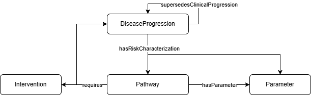

When the risk of a disease progression ([`osdi:hasRiskCharacterization`]({{ config.extra.osdi }}#hasRiskCharacterization)) can be characterized as a deterministic or probabilistic value (a probability, proportion, rate...) it is straightforward to use a **Parameter** ([`osdi:Parameter`]({{ config.extra.osdi }}#Parameter)). A simple example on how to do so was depicted in the [parameters section](parameter.md#42-adding-uncertainty-to-parameters).

However, some times, the risk is not only a number. There can be other restrictions that prevent the appearance of a disease progression. For example, most clinical manifestations of BD only appear in patients with the profound development. Not only this, there may be competitive risks that lead to the emergence of a health problem. **Pathways** ([`osdi:Pathway`]({{ config.extra.osdi }}#Pathway)) allows for the modeling of such more complex "triggers" for a progression.



**Pathways** can define the risk itself (by means of the [`osdi:hasParameter`]({{ config.extra.osdi }}#hasParameter) property), but also extra *requirements* by means of the [`osdi:requires`]({{ config.extra.osdi }}#requires) property.

For example, if you consider the `BD_Proportion_Seizures_PBD` defined in the [parameters section](parameter.md#42-adding-uncertainty-to-parameters), you may add an extra restriction

**TTL Example (Pathway to seizures):**

```turtle
osdi:BD_Pathway_Seizures_PBD
    a owl:NamedIndividual , osdi:Pathway ;
    rdfs:label "Pathway to seizures PBD"@en ;
    osdi:hasDescription "A pathway to seizures in clinically diagnosed profound BD" ;
    osdi:hasParameter osdi:BD_Proportion_Seizures_PBD ;
    osdi:requires osdi:BD_ProfoundBD_Development .  # only individuals with the profound development may suffer seizures
```

Hence, instead of directly using the parameter, the manifestation would make reference to this pathway:

**TTL Example (Modification of the manifestation to use the pathway):**

```turtle
osdi:BD_Seizures
    a osdi:AcuteManifestation ;
    rdfs:label "Seizures due to BD"@en ,
               "Crisis epilépticas debidas a DB"@es ;
    osdi:hasDescription "Acute seizures occurring in untreated or late-treated profound biotinidase deficiency, usually within the first year of life."@en ;
    osdi:hasRiskCharacterization osdi:BD_Pathway_Seizures_PBD .
```

Another useful feature to create more complex characterizations of the progression of a disease is the [`osdi:excludesDiseaseProgression`]({{ config.extra.osdi }}#excludesDiseaseProgression) property, that can be used from any [`osdi:DiseaseProgression`]({{ config.extra.osdi }}#DiseaseProgression) individual. In the [disease progression section](progression.md), we presented an structured way of creating mutually exclusive disease progressions ([`osdi:AlternativeDiseaseProgressionSet`]({{ config.extra.osdi }}#AlternativeDiseaseProgressionSet)). The [`osdi:excludesDiseaseProgression`]({{ config.extra.osdi }}#excludesDiseaseProgression) property is a more specific tool that allows for the creation of more sophisticated relationships.