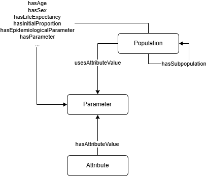

The **Population** ([`osdi:Population`]({{ config.extra.osdi }}#Population)) class defines the target cohort for the interventions under assessment. All the relevant characteristics of the individuals must be defined here, such as the distribution by sex and age, but also clinical characteristics (or patient **Atributes**) that may influence the progression of the disease or the effect of the intervention.



**OSDi** defines some default attributes: [`osdi:Attribute_Age`]({{ config.extra.osdi }}#Attribute_Age), [`osdi:Attribute_Sex`]({{ config.extra.osdi }}#Attribute_Sex), [`osdi:Attribute_LifeExpectancy`]({{ config.extra.osdi }}#Attribute_LifeExpectancy). **Populations** expect values for these **Atributes** by means of specific properties ([`osdi:hasAge`]({{ config.extra.osdi }}#hasAge), [`osdi:hasSex`]({{ config.extra.osdi }}#hasSex)). Such values must be defined as **Parameters**.

For example, the base age for the population of newborns in the reference problem should be 0.

**TTL Example: Definition of the age of the base population**

```turtle
osdi:BD_BasePopulationAge 
    a owl:NamedIndividual , osdi:DeterministicParameter , osdi:Parameter ;
    osdi:hasDescription "Age of the base population of the screening. Assumed to be 0" ;
    osdi:isValueOfAttribute osdi:Attribute_Age ;
    osdi:hasExpectedValue "0.0"^^xsd:double .
```

The population itself would make use of these attribute values:

**TTL Example: Definition of a base population**

```turtle
osdi:BD_BasePopulation 
    a owl:NamedIndividual , osdi:Population ;
    osdi:hasDescription "Birth cohort targeted by BD screening" ;
    osdi:hasAge osdi:BD_BasePopulationAge ;
    osdi:hasEpidemiologicalParameter osdi:BD_BirthPrevalence_ProfoundBD_Spain , osdi:BD_BirthPrevalence_PartialBD_Spain ;
    osdi:hasLifeExpectancy osdi:BD_BasePopulationLifeExpectancy ;
    osdi:hasSex osdi:BD_BasePopulationFemaleProportion ;
    osdi:hasGeographicalContext "Spain @https://www.wikidata.org/wiki/q29" ;
    osdi:hasMinAge "0.0"^^xsd:double ;
    osdi:hasSize 540963 .
```

If required, we can define subgroups of population (e.g., cases with profound BD) using the [`osdi:isSubpopulationOf`]({{ config.extra.osdi }}#isSubpopulationOf) property.

Having different **Populations** allows for testing the same interventions on multiple cohorts. You may characterize different populations in terms of **Attributes** or **EpidemiologicalParameters** ([`osdi:EpidemiologicalParameter`]({{ config.extra.osdi }}#EpidemiologicalParameter)), which capture population-level statistics like incidence or birth-prevalence. For example, you may define a population using the birth prevalence from Galicia, but also a different population with the birth prevalence from a worldwide survey ([Wolf, 1991](https://doi.org/10.1007/BF01800475)).

**TTL Example (Birth Prevalence from Galicia):**

```turtle
osdi:BD_BirthPrevalence_ProfoundBD_Spain
    a owl:NamedIndividual , osdi:DeterministicParameter , osdi:EpidemiologicalParameter ;
    rdfs:label "Birth Prevalence of profound BD (Galicia NBS program)"@en ;
    osdi:hasDataItemType osdi:DI_BirthPrevalence ; # Epidemiological data item type
    osdi:hasExpectedValue 0.0000147885 ;  # Value: 1 in 67 620
    osdi:hasSource "Galicia NBS program data; Vallejo-Torres et al. 2015..."^^xsd:string ;
    osdi:isParameterOf osdi:BD_BasePopulation .
```

**TTL Example (Birth Prevalence from Worldwide survey):**

```turtle
osdi:BD_BirthPrevalence_ProfoundBD_Worldwide
    a owl:NamedIndividual , osdi:DeterministicParameter , osdi:EpidemiologicalParameter ;
    rdfs:label "Birth Prevalence of profound BD (worldwide survey)"@en ;
    osdi:hasDataItemType osdi:DI_BirthPrevalence ; # Epidemiological data item type
    osdi:hasExpectedValue 0.00000890702 ;  # Value: 1 in 112 271
    osdi:hasSource "Wolf 1991, DOI: 10.1007/BF01800475"^^xsd:string ;
    osdi:isParameterOf osdi:BD_WorldwidePopulation .
```
